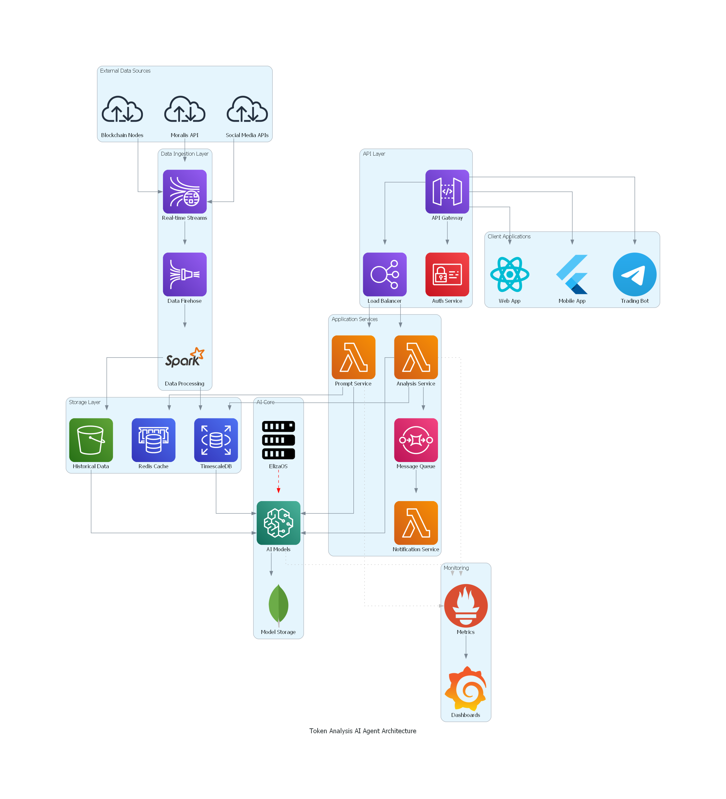

# Token Analysis AI Agent: Building the Future of Decentralized Intelligence

## Our Vision

We are building more than just another analysis tool – we're creating an intelligent, autonomous system that brings unprecedented insight into the blockchain ecosystem. Our Token Analysis AI Agent represents a fusion of cutting-edge artificial intelligence with robust blockchain analytics, all wrapped in a personality-driven interface that makes complex data accessible and actionable.

## Architectural Philosophy

Our architecture embodies three core principles:

- **Intelligence**: Advanced AI models powered by AWS SageMaker and enhanced by ElizaOS for natural interactions make complex analysis intuitive and accessible. Our systems continuously learn and adapt to new market conditions and user needs.

- **Reliability**: Enterprise-grade infrastructure ensures 24/7 operation with high availability and fault tolerance. From AWS Lambda functions to TimescaleDB, every component is chosen for maximum reliability.

- **Scalability**: Cloud-native architecture enables seamless scaling as our user base grows. Our modular design allows for easy upgrades and additions to meet evolving needs.

## System Architecture Breakdown

### 1. The Data Foundation

At the heart of our system lies a sophisticated data pipeline that draws from multiple sources:

- Direct blockchain node connections for real-time transaction data
- Moralis API integration for enhanced blockchain analytics
- Social media APIs for market sentiment analysis
- High-throughput Kinesis streams ensuring no valuable data point is missed

This diverse data foundation gives our AI agent a comprehensive view of the blockchain ecosystem, enabling more accurate and nuanced analysis.

### 2. Intelligent Core

Our AI core is where raw data transforms into actionable intelligence:

- AWS SageMaker hosts our advanced machine learning models
- ElizaOS integration provides our agent with a distinct personality and natural interaction capabilities
- MongoDB ensures our models can learn and adapt from historical analyses
- Real-time processing capabilities allow for immediate response to market changes

### 3. Enterprise-Grade Infrastructure

We've built our system on battle-tested technologies:

- TimescaleDB for precise time-series data management
- Redis caching for lightning-fast response times
- S3 for secure, scalable historical data storage
- AWS Lambda functions for serverless compute efficiency

### 4. Security and Reliability

Security isn't an afterthought – it's woven into every layer:

- API Gateway with robust authentication
- Load balancing for high availability
- Comprehensive monitoring through Prometheus and Grafana
- Message queuing systems for reliable data processing

### 5. User-Centric Interface

Multiple access points ensure our agent is always accessible:

- Modern web application built with React
- Mobile app developed with Flutter
- Telegram bot for instant notifications and trading signals

## Technical Innovation

Our architecture introduces several innovative elements:

1. **Intelligent Data Fusion**

   - Combining blockchain data with AI-driven analysis in real-time
   - Seamless integration of multiple data sources
   - Advanced pattern recognition across diverse datasets

2. **Adaptive Learning**

   - Systems that evolve based on market conditions
   - User interaction-driven improvements
   - Continuous model refinement

3. **Personality Layer**

   - ElizaOS integration making complex analysis approachable
   - Natural language processing for intuitive interactions
   - Contextual awareness in responses

4. **Scalable Processing**
   - Architecture that grows with our user base
   - Elastic resource allocation
   - Efficient load distribution

## Future-Proof Design

Our system is built for the future:

- Cloud-native architecture enabling rapid scaling
- Modular design allowing for easy upgrades and additions
- Integration-ready APIs for future partnerships
- Flexible data models adapting to new blockchain protocols

## Community and Openness

While our architecture is sophisticated, our commitment to the community is simple:

- Transparent operation
- Regular performance metrics
- Community feedback integration
- Continuous improvement

## Conclusion

This architecture represents more than just technical specifications – it's a blueprint for the future of blockchain analytics. By combining robust infrastructure with cutting-edge AI, we're creating a system that not only analyzes the present but helps shape the future of decentralized finance.

Our Token Analysis AI Agent is designed to grow, learn, and evolve alongside the blockchain ecosystem it serves. This is just the beginning of our journey to revolutionize how we understand and interact with blockchain data.

---

_This manifesto represents our commitment to excellence in blockchain analytics and artificial intelligence. As we continue to develop and refine our system, we remain dedicated to our core mission: making complex blockchain data accessible, understandable, and actionable for everyone._
